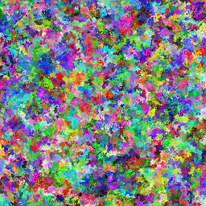
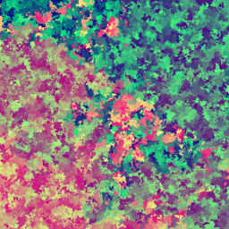
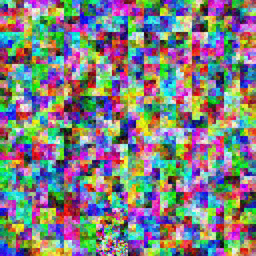
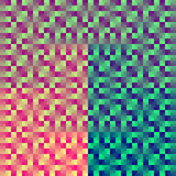
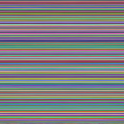
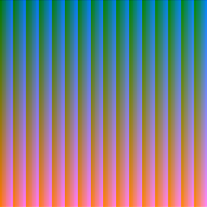

# AllRGB

AllRGB animated visualization with adjustable output sizes and traversal methods.

In the GUI, set `Level` = 11 and `Pixel size` = 1 to generate all AllRGB image.  
A lower `Level` will create an image with smaller dimensions.

Plane traversers are algorithms that traverse the image, returning the next pixel to draw as an (x, y) coordinate.  
Cube traversers traverse the RGB cube, returning the next color to draw as #RRGGBB.
(Note that the `hsl` cube traverser is for testing only; it will not generate a true AllRGB image.)

# Examples

To view the full 4096x4096px files, see the [output folder](output)

|  | DFS cube | Serpentine cube |
|------------|-----|------------|
| DFS plane |  |  |
| Moore plane |  |  |
| Serpentine plane |  |  |
